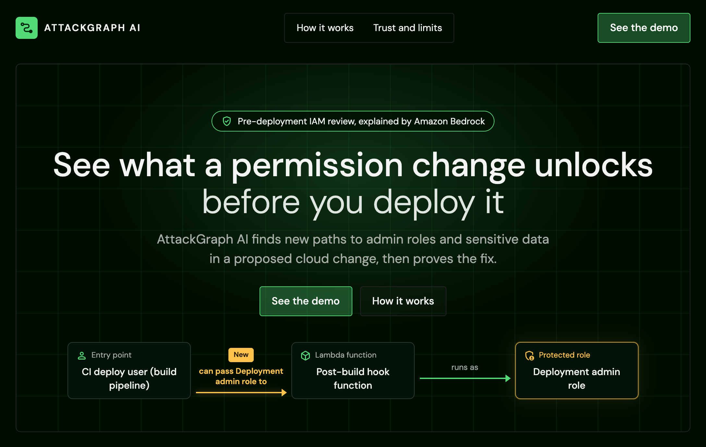
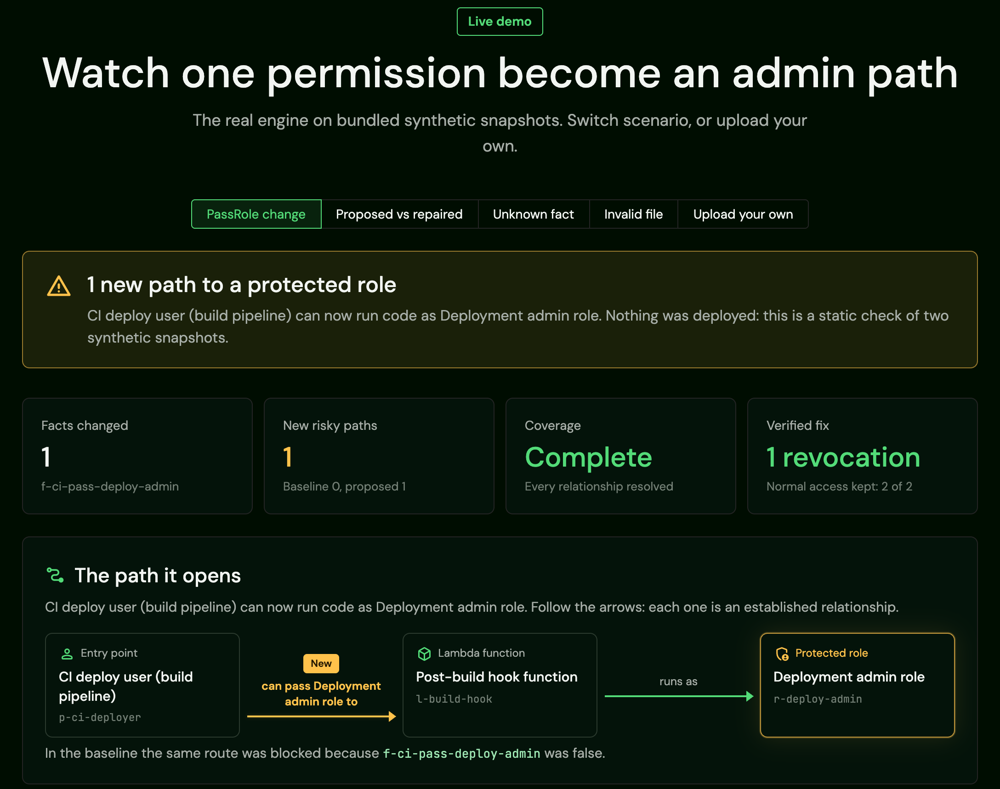
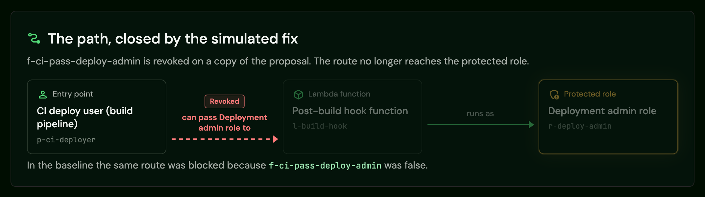
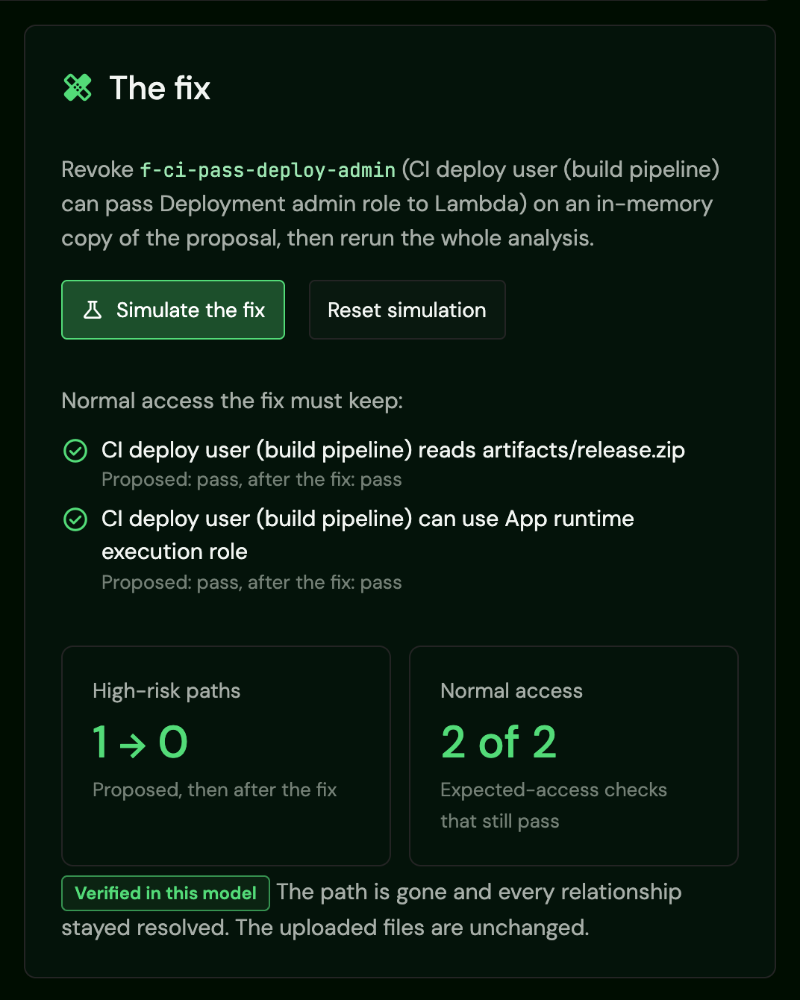

# AttackGraph AI

**See what a cloud permission change unlocks, before you deploy it.**



A pull request that widens one IAM permission can quietly let a build pipeline run code as an administrator. Code review sees the changed line. AttackGraph AI compares the current and proposed configuration, draws the exact route that line opens, explains it in plain English with Amazon Bedrock, and proves which single revocation closes it.

It is a static, defensive review prototype built for the AWS Build Beyond Student AI Demo Challenge 2026. It reads synthetic JSON snapshots, never connects to the accounts they describe, and never deploys or executes anything. Its only AWS call is the Bedrock request for explanation text.

## The demo in three pictures

**1. One changed permission opens a route to the admin role.** The proposal lets the CI deploy user pass the deployment admin role to Lambda. The CI user can already create, invoke and control a Lambda function, so it can now run code as the admin role. In the baseline, that one fact was false and the route was blocked.



**2. Amazon Bedrock explains it; the engine decides it.** Amazon Nova Pro writes the plain-English explanation from an evidence packet of placeholder IDs. It cannot add findings, change severity or invent fixes, and a reply that cites anything outside the packet is rejected.

**3. Simulating the revocation closes the route and keeps normal work running.**





## Run it in one minute

Python 3.11 or newer.

```bash
python3 -m venv .venv && .venv/bin/pip install -r requirements.txt
```

```bash
.venv/bin/streamlit run app.py
```

Open http://localhost:8501. The flagship demo runs as soon as the page loads, so the result is visible without a click. The other scenarios open from the switcher or by link: `?scenario=repair`, `?scenario=unknown`, `?scenario=invalid` and `?scenario=upload`.

```bash
.venv/bin/python -m pytest
```

## Status

| Area | State on 30 September 2026 |
|---|---|
| Engine: validation, Rules A and B, comparison, fix simulation | Implemented. The automated suite passes (`pytest`). |
| Streamlit page | Reskinned after the [Protex](https://protex-template.webflow.io/) template. Checked in a browser at desktop and phone widths in every scenario, and by headless `streamlit.testing` tests. |
| Bedrock explanation | Live on 29 September 2026: Amazon Nova Pro returned 8 validated explanations out of 10 with prompt `explain-v1`, none with an unsupported access or fix claim ([evidence](docs/evidence/ac9-bedrock-review-2026-09-29.md)). The wording defects found in that run are fixed in `explain-v2`, which has not been run live yet. |
| Demo video, hosting | Not started. |

## Amazon Bedrock

| Variable | Default | Purpose |
|---|---|---|
| `ATTACKGRAPH_BEDROCK_MODEL_ID` | `apac.amazon.nova-pro-v1:0` | Any Converse-capable text model or inference profile enabled in your account |
| `ATTACKGRAPH_BEDROCK_REGION` | `AWS_REGION`, then `ap-southeast-1` | Bedrock runtime region |
| `ATTACKGRAPH_AI` | `on` | `off` disables the explanation button, for example on a public host |

The default is Amazon Nova Pro through the APAC cross-region inference profile, confirmed with live inference in `ap-southeast-1` on 29 September 2026. A newly created AWS account can return `AccessDeniedException: Your account is currently being verified` for up to about two hours; the app shows its fallback until then.

Credentials come from the standard AWS credential chain of the machine running Streamlit. They never enter uploads, prompts, reports, logs or the browser. For the demo, use an IAM user or role limited to `bedrock:InvokeModel` on the inference profile and the foundation models it routes to, not root-user keys.

```bash
.venv/bin/python scripts/check_bedrock.py
```

Read-only: prints the model, region and caller type, and checks that the model exists. No inference, no charge.

```bash
.venv/bin/python scripts/check_bedrock.py --invoke --repeat 10 --out ac9-review.md
```

Sends the demo finding through the real pipeline ten times (chargeable, each call well under one US cent), prints request IDs, token usage and latency, and writes every explanation to `ac9-review.md` for claim-by-claim review.

## Demo script

1. Open the page. The hero states the question and already shows the route the flagship change opens.
2. **See the demo** jumps to the live result: "1 new path to a protected role", high-risk paths 0 to 1, coverage complete.
3. **The path it opens**: CI deploy user, then the post-build hook function, then the deployment admin role. The amber arrow is the one new permission. **Why the route works** lists all 7 conditions and marks the changed one.
4. **Explain with Amazon Bedrock**. Match each claim to the conditions card.
5. **Simulate the fix**. The arrow turns red and dashed, high-risk paths go from 1 to 0, normal access stays at 2 of 2, and the card says "Verified in this model".
6. Close on **Trust and limits**: synthetic data only. The prototype verifies this explicit model; wider AWS policy coverage is future work.

The other scenarios show a comparison that closes the path, an unknown fact that makes the result incomplete rather than safe, and field-level validation errors.

## How it works

```text
baseline.json + proposed.json (synthetic)
        |
  validate: size, UTF-8, duplicate keys, raw-policy keys, JSON Schema, references
        |
  derive Rule A / Rule B candidates (three-valued AND over explicit prerequisites)
        |
  NetworkX graph of candidates -> shortest witness per (entry, target), ties broken by fact IDs
        |
  compare findings  ->  revoke each newly enabled grant on a copy and recompute
        |                               |
        |                     Amazon Bedrock (explanation only, aliased evidence)
        +---------------+---------------+
                        |
              Streamlit workspace + Markdown report
```

### Snapshot format

Snapshots are hand-authored JSON that follow [`attackgraph/snapshot.schema.json`](attackgraph/snapshot.schema.json). They are not Terraform plans or raw IAM policies, and the UI labels them "Synthetic configuration JSON".

| Record | Content |
|---|---|
| Snapshot | `schema_version` `"1.0"`, `snapshot_id`, optional `name`, `synthetic: true`, `model_version` `"attackgraph-rules-v1"`, `coverage`, `nodes`, `facts`, `entry_principals`, `protected_targets`, `expected_access` |
| Node | `id`, `kind` (`principal`, `role`, `lambda`, `s3_object`), `label` (display only), `account_id` (must start with `syn-`, so real account numbers stay out) |
| Fact | `id`, `predicate`, `subject`, `object` (omitted for unary predicates), `state` (`"true"`, `"false"`, `"unknown"`). Its JSON pointer is its position in the file. |
| Entry principal | A `principal` node whose control is an explicit scenario assumption |
| Protected target | A node with `privileged_role` (role) or `sensitive_object` (S3 object) classification |
| Expected access | An entry principal, a target and `object_read` or `role_use` that a fix should preserve |
| Coverage | `policy_controls`: whether permissions boundaries, SCPs, resource policies, conditions and explicit denies are `resolved` (already reflected in the facts) or `unresolved`; `unmodelled_mechanisms` present in the scenario |

| Predicate | Subject | Object | Kind |
|---|---|---|---|
| `s3_get_object` | principal or role | s3_object | permission |
| `iam_pass_role_to_lambda` | principal or role | role | permission |
| `lambda_create_function` | principal or role | lambda | permission |
| `lambda_invoke_function` | principal or role | lambda | permission |
| `controls_workload_code` | principal or role | lambda | scenario assumption |
| `role_trusts_lambda_service` | role | none | trust |

Validation stops analysis of both files on any error and reports each one with a JSON pointer. It rejects files over 1 MiB, non-UTF-8 text, duplicate JSON keys, `NaN`, control characters, capitalised IAM policy keys (`Statement`, `Effect`, ...), unknown fields, unsupported versions, dangling references, duplicate IDs, kind mismatches and duplicate facts. Limits: 100 nodes and 300 facts.

### Rules

**Rule A, direct S3 object read.** Established when the subject has a declared effective `s3_get_object` fact for that exact object and policy controls are declared resolved.

**Rule B, role use through a Lambda workload.** One composite edge from a subject to a role, established only when all of these are true for the same subject, role and workload: the subject can pass the role to Lambda, create the workload, invoke it and controls its code; the role trusts the Lambda service; all three share one synthetic account; policy controls are declared resolved. `iam:PassRole` alone never establishes the edge, and no single permission is traversable on its own.

Prerequisites combine with three-valued AND. A false prerequisite blocks the candidate; otherwise an unknown one leaves it unresolved. A prerequisite with no declared fact is unknown, not false. Cross-account combinations and unresolved policy controls are also unknown.

Candidates are evaluated for every subject that is reachable, or possibly reachable, from an entry principal. Rule A is evaluated against every protected object and expected-access object, and Rule B against every other role through every Lambda workload. **A fixture must declare an explicit `false` fact for each relationship it rules out**; otherwise that relationship is unknown and coverage is incomplete.

### Coverage and comparison

Coverage is complete only when every evaluated candidate resolves to true or false, every policy control is resolved and no unmodelled mechanism is declared. "Complete" means complete for the declared synthetic model, not for an AWS account.

A finding's identity is `(entry principal, protected target, impact)`, so array order and labels never change it. Added, removed and unchanged are computed from those identities. When either snapshot is incomplete every label is provisional, and a change that involves an unresolved side is shown as inconclusive. An unchanged finding whose witness differs is flagged "evidence changed". Every finding is High severity, whatever its comparison status. This is a demo rubric, not CVSS. Access to unprotected objects appears only as an informational expected-access check.

### Fix simulation

Candidates are grants that the baseline declares false and the proposal turns true under the same fact ID, and that lie on a route to a proposal finding. Scenario assumptions are excluded. Each candidate is set back to `false` on a copy of the proposal; the record is kept, because deleting it would make it unknown. The whole analysis is then recomputed. A candidate is **Verified in this model** only when the finding disappears and coverage stays complete.

Complete candidates rank by fewest failing expected-access checks, then most findings removed, then fact ID, and any collateral change is shown. At most 25 candidates are simulated per comparison. A single-revocation test does not find a minimum cut or prove that real workflows keep working.

### AI explanation boundaries

- The evidence packet replaces every node, fact, check and fix with an opaque alias (`P1`, `F1`, `X1`...). No label or uploaded ID reaches the prompt.
- Converse is called with no tools, `maxTokens` 700, temperature 0.2, one attempt and a 20-second timeout. The call runs only when the button is pressed.
- The reply must be exactly `{finding_id, summary, evidence_ids, fix_candidate_id, limitations}`. Every cited ID and every alias in the prose must exist in the packet, and length limits apply. Anything else is discarded.
- Refusals, timeouts, credential errors and rejected replies show "AI explanation unavailable" with the reason, above the deterministic template summary. Engine results never change.
- Successful replies are cached per analysis, finding, fix, model and prompt version, and a cached reply is labelled. A reply produced for different inputs is never shown.
- Model text is escaped before rendering. Identifier checks cannot prove that the prose is true, so review generated claims against the evidence.

## Acceptance criteria

| ID | Where it is checked |
|---|---|
| AC-1 | `tests/test_rules.py::test_ac1_baseline_proposal_and_repair` |
| AC-2 | `tests/test_rules.py`: each prerequisite false, cross-account, unresolved controls, PassRole alone |
| AC-3 | `tests/test_compare.py` (unknown, unresolved, inconclusive transitions) and `tests/test_validation.py` (field-level errors) |
| AC-4 | `tests/test_rules.py`: every pointer resolves to the supplied record; labels confer no privilege |
| AC-5 | `tests/test_compare.py`: reordering, relabelling, removal, evidence change, severity, informational access |
| AC-6 | `tests/test_rules.py`: alternative routes, no effective single fix, cycles, stable tie-breaks |
| AC-7 | `tests/test_simulate.py`: verified fix, expected access kept, input bytes unchanged, ranking |
| AC-8 | `tests/test_explain.py`: invalid IDs, malformed output, refusal, timeout, errors, cache, stale replies |
| AC-9 | [Run on 29 September](docs/evidence/ac9-bedrock-review-2026-09-29.md) with `explain-v1`: 8 of 10 validated, no unsupported claims, wording defects fixed in `explain-v2`. Re-run `scripts/check_bedrock.py --invoke --repeat 10 --out ac9-review.md` for `explain-v2` and review every claim before recording |
| AC-10 | `tests/test_explain.py` (no uploaded text in the prompt, escaping) and `tests/test_validation.py` (oversized and unsupported files) |
| AC-11 | `tests/test_report.py`, `tests/test_app.py`; keyboard pass by hand |
| AC-12 | Manual: fresh clone run, video in a signed-out browser, claims match this README |

Performance, measured on the build laptop against the two-second target: the bundled comparison plus fix simulation takes about 5 ms. A generated 100-node, 300-fact pair compares in about 1.5 s, and each fix simulation on it adds about 0.7 s.

## Limitations

- Only the two rule families above are modelled. There is no Terraform or CloudFormation parsing, IAM policy evaluation, EC2, general AssumeRole, live discovery, multi-account analysis or automatic remediation.
- Policy controls are not evaluated. The fixture declares whether their effect is already reflected in its facts.
- Entry-principal control and workload-code control are scenario assumptions, not findings about any real account.
- Results describe the declared synthetic model. They are not a detection rate on real cloud environments.

## Hosting note

Local execution plus a recorded video is the intended submission. If you host it, restrict it to bundled fixtures or set `ATTACKGRAPH_AI=off`. Do not expose an anonymous upload endpoint that can trigger chargeable Bedrock calls.

## Layout

```text
app.py                         Streamlit page: story layout, scenario switching, uploads
attackgraph/story.py           plain-language view of one finding (path, conditions, changes)
attackgraph/web.py             Protex-style CSS and escaped HTML fragments
attackgraph/snapshot.py        records, parsing, validation
attackgraph/snapshot.schema.json
attackgraph/analysis.py        Rule A/B candidates, coverage, witnesses (NetworkX)
attackgraph/compare.py         finding deltas, fact and configuration changes
attackgraph/simulate.py        fix candidates and ranking
attackgraph/explain.py         Bedrock packet, validation, fallback template
attackgraph/report.py          Markdown export
attackgraph/render.py          escaping and Graphviz witness
fixtures/demo/                 baseline, proposed, repaired
fixtures/examples/             unknown fact, unresolved SCP, label injection, invalid files
scripts/check_bedrock.py       Bedrock access and AC-9 evidence
docs/evidence/                 recorded live Bedrock runs and their review
docs/images/                   README screenshots of the running app
tests/                         automated suite
```
