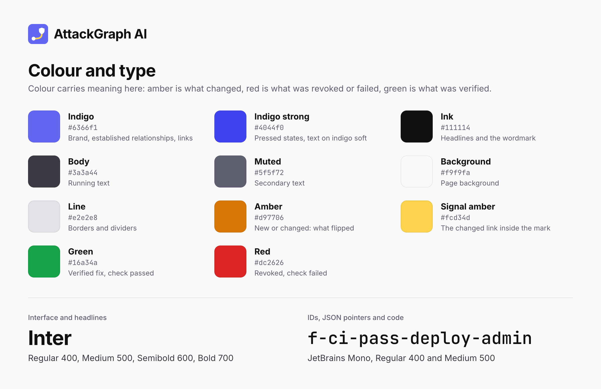

# AttackGraph AI brand kit

The identity comes from the product itself: a route from an entry point to a protected role, where one link, the permission that changed, turns amber.

## Name and lines

- Write it **AttackGraph AI**: "AttackGraph" is one word with a capital A and G, followed by "AI". Not "Attack Graph", "Attackgraph" or "AG AI".
- Category: *Pre-deployment review for cloud permission changes.*
- Headline: *Ship permission changes without shipping admin access.*
- One-line description: *See what a cloud permission change unlocks, before you deploy it.*
- Trust line: *Built to be checked, not trusted.*

## Logo

| File | Use |
|---|---|
| [`mark.svg`](mark.svg) | App icon, favicon, avatar and README header. Vector, no text. |
| [`mark-512.png`](mark-512.png) | The mark as a 512 × 512 PNG for upload forms. |
| [`logo.png`](logo.png) | Mark and wordmark on light backgrounds. |
| [`logo-dark.png`](logo-dark.png) | Mark and wordmark on dark backgrounds. |
| [`social-preview.png`](social-preview.png) | GitHub social preview, 1280 × 640: repository Settings, then Social preview. |
| [`palette.png`](palette.png) | Colour and type sheet. |

The mark is an indigo tile with a white entry point, an amber route (the permission that changed) and a white shield (the protected role).

- **Clear space:** at least a quarter of the tile's width on every side.
- **Minimum size:** 16 px for the mark, 120 px wide for the logo.
- **Wordmark:** Inter Bold with −2% tracking, set at 0.65 × the tile's height and 0.27 × the tile's height away from it. The logos are PNGs because an SVG with live text renders in whatever font the viewer has installed.
- **Don't** recolour the tile or the route, add shadows or outlines, rotate or stretch the mark, or place the logo on a busy photo.

## Colour

Colour carries meaning in the product, so keep it consistent: amber is what changed, red is what was revoked or failed, green is what was verified or passed, and indigo is an established relationship and the brand.

| Name | Hex | Use |
|---|---|---|
| Indigo | `#6366f1` | Brand, established relationships, links |
| Indigo strong | `#4044f0` | Pressed states, text on indigo soft |
| Indigo soft | `#eef0ff` | Tinted backgrounds and chips |
| Ink | `#111114` | Headlines and the wordmark |
| Body | `#3a3a44` | Running text |
| Muted | `#5f5f72` | Secondary text |
| Background | `#f9f9fa` | Page background |
| Surface | `#ffffff` | Cards |
| Line | `#e2e2e8` | Borders and dividers |
| Amber | `#d97706` | New or changed, on light backgrounds |
| Signal amber | `#fcd34d` | The changed link inside the mark, amber borders |
| Green | `#16a34a` | Verified fix, check passed |
| Red | `#dc2626` | Revoked, check failed |

These are the CSS tokens in [`attackgraph/web.py`](../../attackgraph/web.py), so the app, the hosted site and these assets stay in step.

## Type and icons

- **Inter** 400, 500, 600 and 700 for the interface and headlines.
- **JetBrains Mono** 400 and 500 for IDs, JSON pointers and code.
- **Material Symbols Rounded** for icons: `person` for an entry point, `deployed_code` for a Lambda function, `admin_panel_settings` for a protected role.

All three come from Google Fonts.

## Voice

- Plain and exact. Say "verified in this model", never "secure". A missing fact is "unknown", never "safe".
- Give the AI its real role: Amazon Bedrock explains, the engine decides.
- State limits up front: synthetic data only, nothing is deployed.
- Sentence case for headings in the product, and no em dashes.

## How these files were made

The mark is hand-written SVG. The PNGs were drawn in HTML with the tokens above and rendered with headless Chrome at 2× (the social preview at 1×). The Devpost images in [`../devpost/`](../devpost/) use the same kit.
