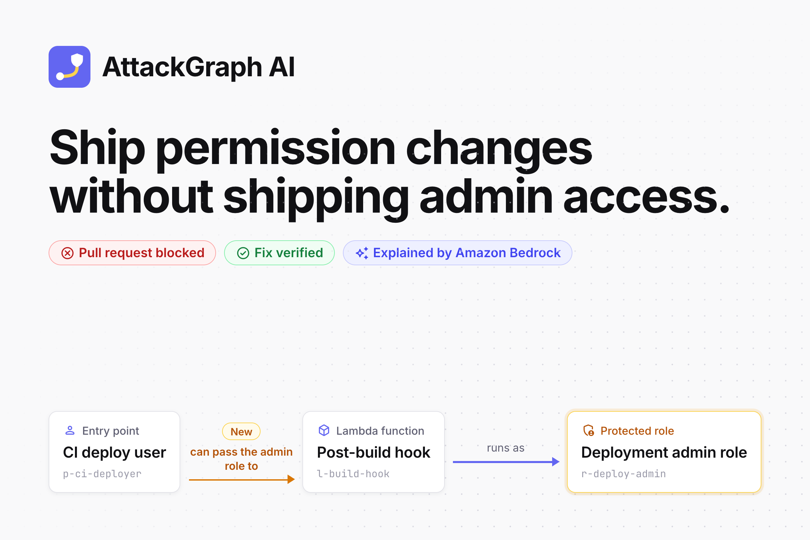

# Devpost submission: AttackGraph AI

Everything for the Devpost form, in the order the form asks for it. Paste each block into its field; the images are in this folder.

## Project name

AttackGraph AI

## Elevator pitch

Pick one; each fits Devpost's 200-character limit. Both say "tests the fix", matching the product's "Verified in this model".

185 characters:

> See what a cloud permission change unlocks before you deploy it: AttackGraph AI finds the new route to admin, explains it with Amazon Bedrock, tests the fix and blocks the pull request.

180 characters:

> One IAM change can hand your build pipeline admin. AttackGraph AI finds the new route, explains it with Amazon Bedrock, tests the fix and blocks the pull request on the exact line.

## Thumbnail

[`thumbnail.png`](thumbnail.png): 2400 × 1600, 3:2.

## Image gallery

Upload in this order. Each image is 2400 × 1600 (3:2) and under 1 MB.

| # | File | Caption |
|---|---|---|
| 1 | [`gallery/01-the-idea.png`](gallery/01-the-idea.png) | One changed permission can open a route to admin. AttackGraph AI checks what a change completes, not just the line that changed. |
| 2 | [`gallery/02-blocked-pull-request.png`](gallery/02-blocked-pull-request.png) | The GitHub Actions check fails and marks line 27, the line that opens the route, with the route and the verified fix. |
| 3 | [`gallery/03-the-path.png`](gallery/03-the-path.png) | The path it opens: CI deploy user, post-build hook, deployment admin role. All 7 conditions hold; one changed. |
| 4 | [`gallery/04-amazon-bedrock.png`](gallery/04-amazon-bedrock.png) | Amazon Nova Pro explains the finding from placeholder IDs. Every ID it cites is checked; it cannot add findings or fixes. |
| 5 | [`gallery/05-verified-fix.png`](gallery/05-verified-fix.png) | Revoking the one new grant on a copy takes high-risk paths from 1 to 0, and both normal access checks still pass. |
| 6 | [`gallery/06-check-passes.png`](gallery/06-check-passes.png) | The fix commit reverts the line, and the same check reports no new modelled high-risk access. |
| 7 | [`gallery/07-how-it-works.png`](gallery/07-how-it-works.png) | Static and offline: synthetic snapshots in, a verdict that points at JSON lines out. The only AWS call is the explanation. |

## About the project

Paste everything between the two rules. Devpost renders Markdown.

---

## Inspiration

Widening `iam:PassRole` reads as a one-word edit in code review. Whether it hands out admin depends on grants made long before: can the build pipeline also create a Lambda function, invoke it and control its code? Does the admin role trust Lambda? Each permission looks harmless alone. Together they let a pipeline run code as an administrator.

A reviewer sees the changed line. The risk lives in what that line completes. We wanted a check that answers the reviewer's real question: what new access does this change create, and which permission should go?

## What it does

AttackGraph AI compares the current and the proposed configuration of a cloud account, written as synthetic JSON snapshots, and reports every new route from an entry point to a protected role or data.

- **Finds the route.** Two explicit rules link permissions into routes. In the flagship demo, one change completes all 7 conditions of a route from the CI deploy user, through a post-build Lambda function, to the deployment admin role.
- **Points at the line.** Every condition carries its JSON pointer, and the one that changed is marked.
- **Explains it with Amazon Bedrock.** Amazon Nova Pro writes a plain-English explanation from an evidence packet of placeholder IDs. It cannot add findings, change severity or invent fixes. A reply that cites anything outside the packet is rejected, and a deterministic summary is shown instead.
- **Verifies the fix in the model.** It revokes each newly enabled grant on a copy and reruns the whole analysis. The flagship fix takes high-risk paths from 1 to 0 while both normal access checks still pass: "Verified in this model".
- **Blocks the pull request.** `python -m attackgraph` runs as a GitHub Actions check. It fails on a new path, an incomplete result or an invalid file, and annotates the exact line responsible.
- **Never calls an unknown safe.** If a snapshot does not say whether a permission exists, the result is incomplete and the check fails.

It is a defensive review prototype: it reads synthetic data only, never connects to the accounts it describes, and never deploys or executes anything.

## How we built it

- **Engine, in Python:** snapshot validation (size, UTF-8, duplicate keys, raw IAM policy keys, JSON Schema, references), rule evaluation with three-valued logic, shortest witness routes with NetworkX, comparison by finding identity, and fix simulation.
- **Amazon Bedrock:** the Converse API with Amazon Nova Pro through the APAC cross-region inference profile. No tools, temperature 0.2, at most 700 tokens, one attempt and a 20-second timeout. Replies are validated against the packet and cached per analysis.
- **App:** Streamlit, with an overview and a live demo. A static build of the same pages runs on Vercel, with no AI calls and no uploads.
- **Pull-request check:** a command-line entry point and a GitHub Actions workflow that compares each changed snapshot with its version on the base branch and writes GitHub annotations.
- **Tests:** more than 130 pytest tests mapped to the acceptance criteria, plus a recorded, claim-by-claim review of live Bedrock output.

## Challenges we ran into

- **Making the AI trustworthy.** The model must never be the source of truth. Aliasing every node, fact and fix, rejecting any reply that cites an unknown ID, and always keeping a deterministic summary made the explanation safe to show.
- **Honest unknowns.** A permission nobody described is easy to read as absent. Three-valued logic and a coverage check turn "we don't know" into an incomplete result instead of a false all-clear.
- **Verifying a fix without over-claiming.** "Verified in this model" means the engine reran everything with the permission revoked, the route disappeared and every relationship stayed resolved. It is not a promise about a real account.
- **Hosting the demo.** Vercel can't run Streamlit's WebSocket server, so the demo is pre-computed into a static site. It shows the recorded Nova Pro reply only while its analysis ID still matches the fresh analysis.
- **Check output that can't be spoofed.** Labels, keys and file names come from the pull request, so every line the check prints starts with fixed text, and every GitHub workflow command is escaped.

## Accomplishments that we're proud of

- A live Amazon Bedrock run on 29 September 2026: of ten calls, eight explanations passed validation and none made an unsupported access or fix claim. The reply validator rejected one reply, and AWS refused one call while the new account was being verified.
- Every result traces back to a line in the input files.
- The check blocked a real pull request on GitHub, with its note on line 27: the exact line that opened the route.
- It is fast enough to sit in review. Measured on 30 September 2026 on the build laptop, the bundled comparison and fix simulation take about 10 ms, well inside the two-second target. At the input limits of 100 nodes and 300 facts, random pairs take 0.4 to 2.2 s, and one principal able to pass 49 roles into 49 functions takes about 11 s, so the target does not hold for every input.

## What we learned

- Constraining the model works. Giving it aliases instead of names, and checking every identifier it cites, kept its accepted explanations free of unsupported claims.
- Permission risk is about combinations. Modelling "every condition must hold" is what makes the one changed condition stand out.
- Saying "unknown" out loud is a feature, not a weakness.

## What's next for AttackGraph AI

- Read Terraform plans and IAM policies directly instead of hand-written snapshots.
- Evaluate policy controls such as SCPs, permissions boundaries and conditions, instead of taking them as declared.
- More rule families, starting with `sts:AssumeRole` chains and EC2 instance profiles.
- Multi-account analysis, and fixes that find the smallest set of revocations.

---

## Built with

`python` `streamlit` `networkx` `jsonschema` `amazon-bedrock` `amazon-nova` `boto3` `github-actions` `vercel` `pytest`

## Try it out

- Overview: https://attackgraph-ai.vercel.app
- Live demo: https://attackgraph-ai.vercel.app/demo
- Code: https://github.com/Ducksss/attackgraph-ai

## Video demo

Not recorded yet. A three-minute outline that follows the README's demo script:

1. **0:00** The problem: the overview's hero diagram. One pull request widens `iam:PassRole` and completes a route to the admin role.
2. **0:30** The live demo opens on the pull request: line 27 flips, the check fails and leaves its note on that line.
3. **1:05** Inside the check: the path it opens, the fact that flipped, and the 7 conditions.
4. **1:45** Amazon Bedrock: the Nova Pro explanation, and why it can't change the result.
5. **2:20** The fix: revoke one grant, high-risk paths 1 to 0, normal access 2 of 2, then the fix commit passes the check.
6. **2:45** Trust and limits: synthetic data only, and nothing is deployed.

## Before you submit

- [ ] Record the video and add its link.
- [x] The repository is public, so judges can open the code and the demo pull request.
- [ ] The live Bedrock evidence is for prompt `explain-v1`. Re-run it with `explain-v2` before quoting results for the current prompt.
- [x] The repository is under the MIT License.
- [ ] Confirm the "What's next" list: it proposes future work, not commitments.
